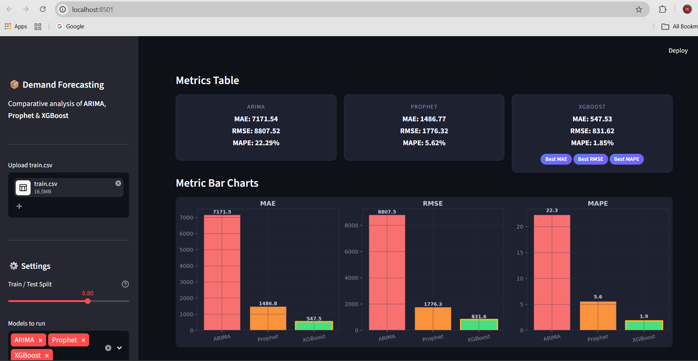

# 📦 Demand Forecasting: Comparative Analysis of ARIMA, Prophet & XGBoost

A complete time-series forecasting project that benchmarks three popular approaches — a classical statistical model, an automated decomposition model, and a gradient-boosted machine learning model — on daily retail sales data.

---

##  Project Structure

demand_forecasting/

│

├── app.py                     

├── demand_forecasting.ipynb          

├── requirements.txt           

├── train.csv             

└── README.md                  

---

## Dataset

| Column  | Description                      |
|---------|----------------------------------|
| `date`  | Transaction date (YYYY-MM-DD)    |
| `store` | Store ID (integer)               |
| `item`  | Item/SKU ID (integer)            |
| `sales` | Number of items sold on that day |

---

##  Methodology

### 1. Exploratory Data Analysis
- Raw time-series visualization
- 30-day rolling mean and standard deviation
- Monthly aggregation and day-of-week patterns
- Sales distribution

### 2. Stationarity Testing & Decomposition
- **Augmented Dickey-Fuller (ADF)** test for stationarity
- **ACF / PACF** plots to guide ARIMA order selection
- **Seasonal decomposition** (additive, period = 365)

### 3. Train / Test Split
An 80/20 chronological split is used — **no random shuffling** to preserve temporal integrity.

---

##  Models

### 🔵 ARIMA (1, 0, 1)
- Chosen order guided by ADF test and ACF/PACF plots
- Best for: **linear, stationary** series with low computational cost

### 🟠 Prophet
- Automatically models **yearly and weekly seasonality**
- Provides built-in uncertainty intervals
- Best for: **business time series** with strong seasonality

### 🟢 XGBoost (Gradient Boosting)
- ML model trained on hand-crafted temporal features

| Category      | Features                                                     |
|---------------|--------------------------------------------------------------|
| Calendar      | year, month, day, dayofweek, quarter, weekofyear, is_weekend |
| Lag features  | lag_1, lag_7, lag_14, lag_30                                 |
| Rolling stats | rolling_mean_7/14/30, rolling_std_7/14/30                    |

---

##  Evaluation Metrics

| Metric   | Interpretation                              |
|----------|---------------------------------------------|
| **MAE**  | Average absolute error in original units    |
| **RMSE** | Penalizes large errors more than MAE        |
| **MAPE** | Scale-independent percentage error          |

---

##  Results

| Model        | MAE | RMSE | MAPE (%) |
|--------------|-----|------|----------|
| ARIMA(1,0,1) | 7171.54 | 8807.52 | 22.29 |
| Prophet      | 1486.77 | 1776.32 | 5.62 |
| XGBoost      | 547.53 | 831.62 | 1.85 |

---

##  How to Run

**1. Clone the repository**

```bash
git clone https://github.com/YourUsername/demand-forecasting.git
cd demand-forecasting
```

**2. Install dependencies**

```bash
pip install -r requirements.txt
```

**3. Run the Streamlit app**

```bash
streamlit run app.py
```

**4. Or run the notebook**

```bash
jupyter notebook demand_forecasting.ipynb
```

---

##  App Preview



---

##  Project Highlights

- ✅ Full EDA with rolling statistics and seasonal decomposition
- ✅ Stationarity testing using ADF test
- ✅ ACF / PACF plots for ARIMA order selection
- ✅ Prophet with confidence intervals and component plots
- ✅ XGBoost with 17 engineered features
- ✅ Side-by-side model comparison
- ✅ Interactive Streamlit dashboard
- ✅ Kaggle submission file generated

---

##  Key Takeaways

| Aspect               | ARIMA          | Prophet            | XGBoost                     |
|----------------------|----------------|--------------------|-----------------------------|
| Setup complexity     | Low            | Very Low           | Medium                      |
| Seasonality handling | Manual (SARIMA)| Automatic          | Via lag/rolling features    |
| Uncertainty intervals| Yes            | Yes (built-in)     | No                          |
| Speed                | Fast           | Moderate           | Moderate–Fast               |
| Best for             | Short, linear  | Business series    | Large datasets, tabular ML  |

---

##  Kaggle Competition

This project is based on the
[Store Item Demand Forecasting Challenge](https://www.kaggle.com/competitions/demand-forecasting-kernels-only)

---

##  Requirements

- Python 3.8+
- pandas, numpy, matplotlib, seaborn
- statsmodels, prophet, xgboost
- scikit-learn, streamlit, jupyter


---

##  Author

**Your Name**
- GitHub: (https://github.com/ranjanmandal-cse)
- LinkedIn: www.linkedin.com/in/ranjan-kumar-mandal-1886a5196

---

##  License

MIT License — free to use and modify.

---

*Built with ❤️ using Python, statsmodels, Prophet, XGBoost and Streamlit.*
